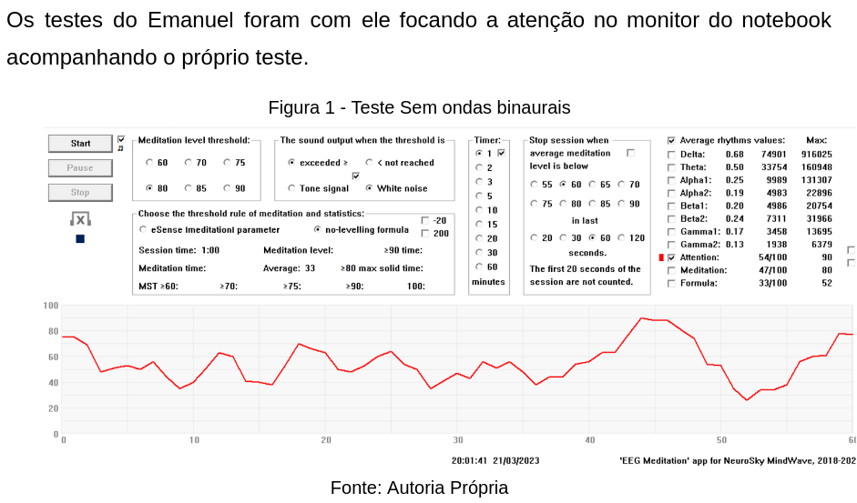
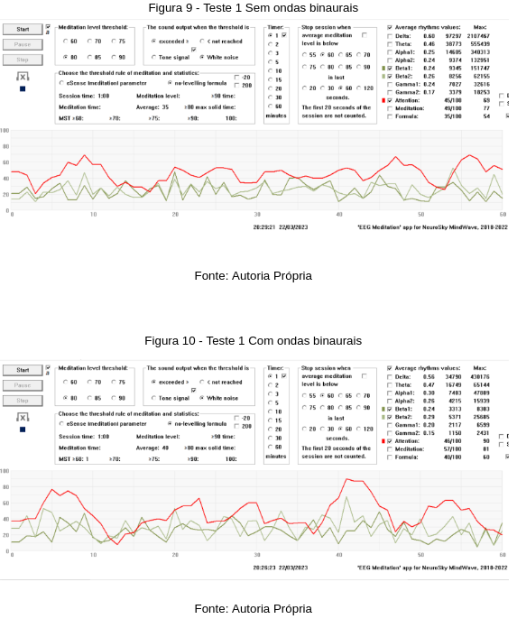
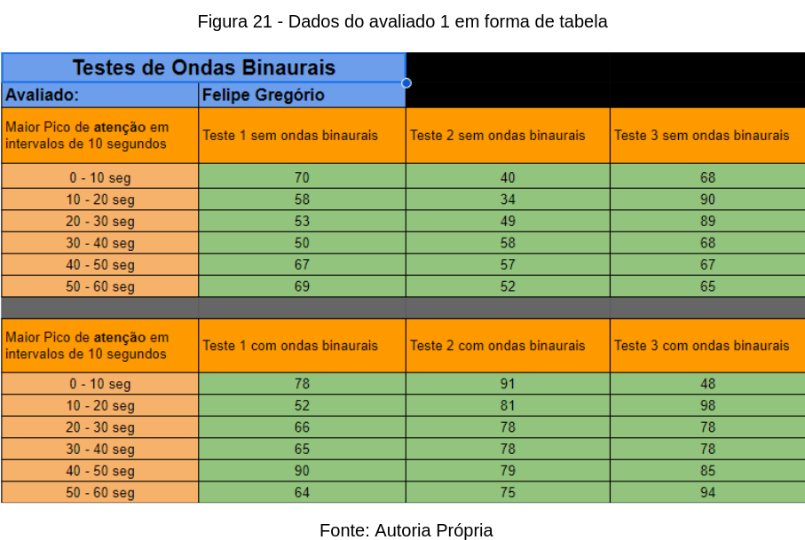

# 
Curso: Engenharia de Software

### 
Disciplina: Engenharia de Software Experimental

### 
8º Período

### 
Equipe

 
Emanuel Guilherme - 201920975

 
João Acioly - 201921070

 
Leonardo Aguiar - 201921285

 
Marcel Oluap- 201921332

### 
Professor: Marcio Garrido

  
### 
 **Introdução:**

As ondas binaurais são uma técnica de estimulação cerebral que envolve a reprodução de duas frequências diferentes em cada ouvido do usuário. Geralmente as frequências são próximas, e o cérebro tenta encontrar uma frequência média que possa ser usada para processamento.

A pesquisa em ondas binaurais tem sido cada vez mais popular devido à sua associação com vários benefícios para a saúde, incluindo a melhoria da memória, da concentração e do sono, além de redução do estresse e da ansiedade. Acredita-se que essas ondas possam ajudar na sincronização dos dois hemisférios cerebrais, resultando em um melhor desempenho cognitivo e emocional.

Nosso experimento visa colocar o usuário sobre o efeito da onda beta de 20Hz e verificar se teve mudanças nos niveis de alerta e concentração

### 
 **Processo:**
Para a realização do experimento, foi utilizado um aparelho junto a um software que fazem a medição da frequência cerebral do usuário. O software também permite a gravação dos dados coletados, que serão utilizados para a análise dos resultados.

### 
 **Etapa 1:**
A primeira etapa do experimento consiste em realizar o reconhecimento do software e aparelho onde testamos nos integrantes da equipe com e sem as ondas binaurais.

### 
 **Etapa 2:**
A segunda etapa do experimento consiste em realizar o experimento completo nos indivíduos, onde eles se concentravam em algo específico e faziam o teste com e sem ondas, assim podemos comparar os resultados e verificar se houve mudanças nos níveis de alerta e concentração. Além de terem passado por um questionário para se ter um melhor conhecimento do indivíduo em si.

### 
 **Etapa 3:**
A terceira etapa do experimento consiste em analisar os dados coletados, colocando-os em ordem em uma planilha para verificar se houve mudanças nos níveis de alerta e concentração.

 

### 
 **Link de apresentação de slides do trabalho:**
https://www.canva.com/design/DAFfJ-tyy1o/L8_2MT_Dk_k_iScKJBxOPw/view?utm_content=DAFfJ-tyy1o&utm_campaign=designshare&utm_medium=link&utm_source=publishsharelink

 # Trabalho_Experimento
